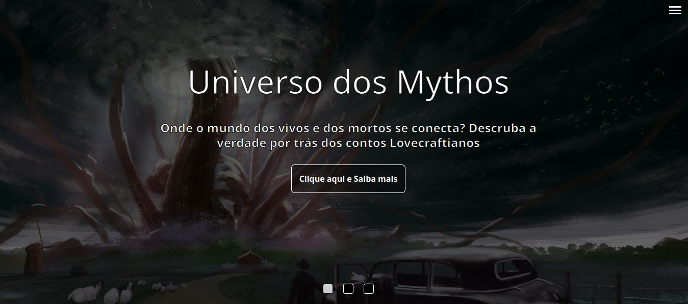

<h1 align="center">Cthulhu Mythos</h1>

Projeto Projeto criado para praticar alguns conceitos como alternância de slides, display grid e menus flutuantes.

<h3 align="center">https://brunocabralsilva.github.io/cthulhu-mythos/</h3>

<h2> Índice</h2>

* [Introdução](#intro)
* [Descrição do Projeto](#descrição-do-projeto)
* [Mapeamento do Site](#mapeamento)
* [Tecnologias utilizadas](#tecnologias-utilizadas)
* [Desenvolvedores e demais contribuidores](#pessoas-envolvidas)
* [Conclusão](#conclusão)

<h2 id="intro">Introdução</h2>

    Os Mitos de Cthulhu (do inglês, Cthulhu Mythos) é o termo usado pelo escritor August Derleth como referência ao panteão de monstros e seres fantásticos que habitam os contos de ficção científica e horror de Howard Phillips Lovecraft. Subsequentemente, o termo também é usado pelas gerações de escritores influenciados por sua vida e obra.

 Constitui-se uma mitopéia e um universo ficcional compartilhado, originado nas obras do escritor de terror americano H. P. Lovecraft . O termo foi cunhado por August Derleth, um correspondente contemporâneo e protegido de Lovecraft, para identificar os cenários, locais e tradição que foram empregados por Lovecraft e seus sucessores literários. O nome Cthulhu deriva da criatura central no conto seminal de Lovecraft " The Call of Cthulhu ", publicado pela primeira vez na revista "pulp Weird Tales" em 1928.

Richard L. Tierney , um escritor que também escreveu contos de Mitos e, tarde aplicou o termo "Mitos de Derleth" para distinguir as obras de Lovecraft das histórias posteriores de Derleth, que modificam os princípios fundamentais dos Mitos originais de Lovecraft. Autores de terror Lovecraftiano, em particular, freqüentemente usam elementos dos Mitos de Cthulhu.

<strong>Fonte :</strong>https://pt.wikipedia.org/wiki/Mitos_de_Cthulhu 

<h2 id="descrição-do-projeto">Descrição do Projeto</h2>

A aplicação em questão possui algumas funcionalidades importantes para o aprendizado, tais quais:
<li>A cada cinco segundos, um novo slide é apresentado na tela;</li>
<li>Caso o usuário clique em um dos botões que alternam os slides, um novo slide só é apresentado após dez segundos, garantindo que a alternância de slides não afete a experiência do usuário.</li>
<li>Existe um grid ao fim onde os blocos em foco tem um destaque de luminosidade;</li>
<li>Foi criado um menu minimizado que pode ser exibido ao clicar no ícone superior direito que sempre estará visível na tela.</li>

<h2 id="tecnologias-utilizadas">Tecnologias utilizadas</h2>

* `HTML5`
* `CSS3`
* `Javascript (ECMAScript 2018)`
* `React`
* `React Router Dom`

<h2 id="pessoas-envolvidas">Desenvolvedores e demais contribuidores</h2>

* <strong>Bruno Gabryell Cabral da Silva</strong> - Desenvolvedor Web;

<h2 id="conclusão">Conclusão</h2>

Programar é um eterno aprendizado. Quanto mais se pratica, mais se melhora. Praticar conceitos de programação com coisas que se é apaixonado apimenta ainda mais a relação! Muitos aprendizados novos são adicionados a cada dia, fazendo com que este projeto já tenha valido a pena antes mesmo de ser concluído!

